# Sudoku

An app designed to generate sudokus of a given difficulty, letting the user solve them within the app.
Supports multiple grid sizes and also has a separate sudoku solver functionality.

## Generator

When the app is first opened, the following menu is shown for generating a new sudoku:

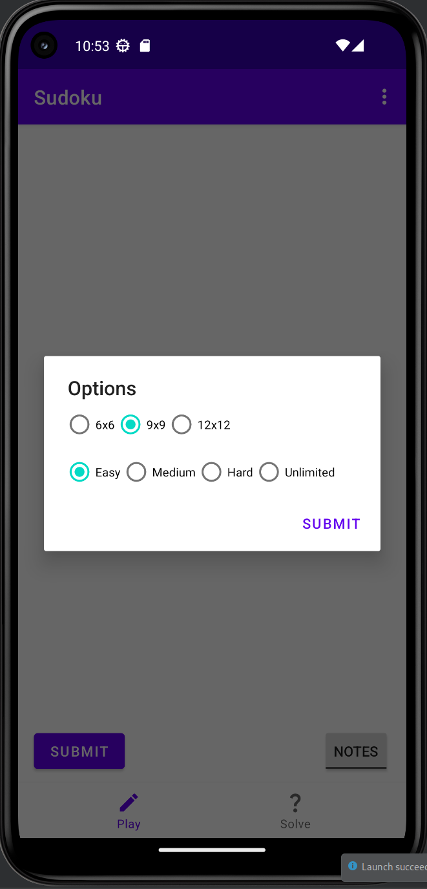

The following are examples of sudokus of the different sizes:

    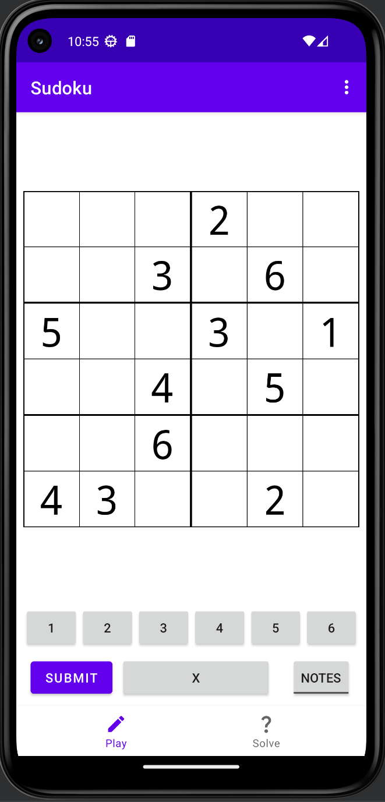
    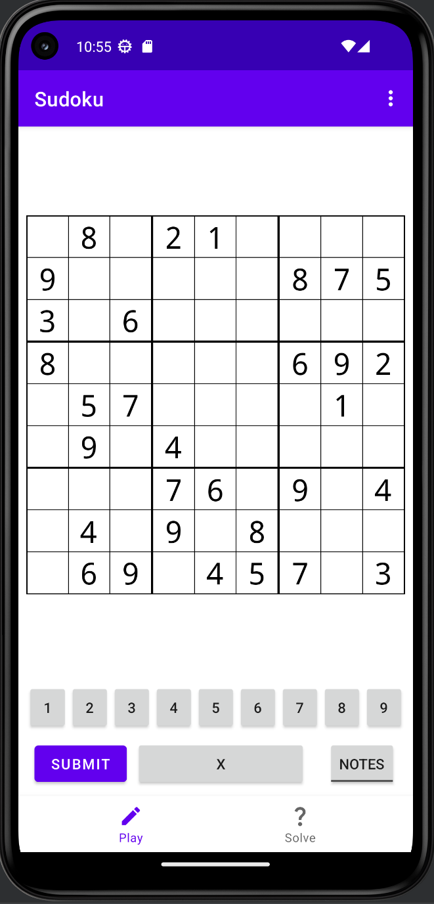
    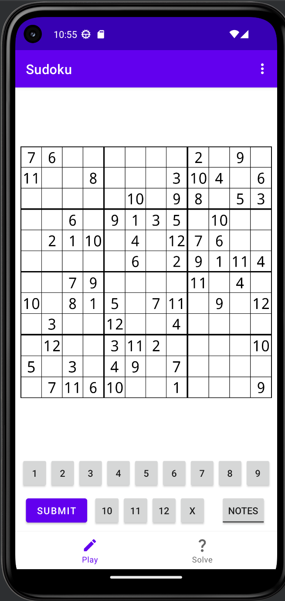

User experience features are also provided in the form of notes (pencil marks) and colouring any errors made:

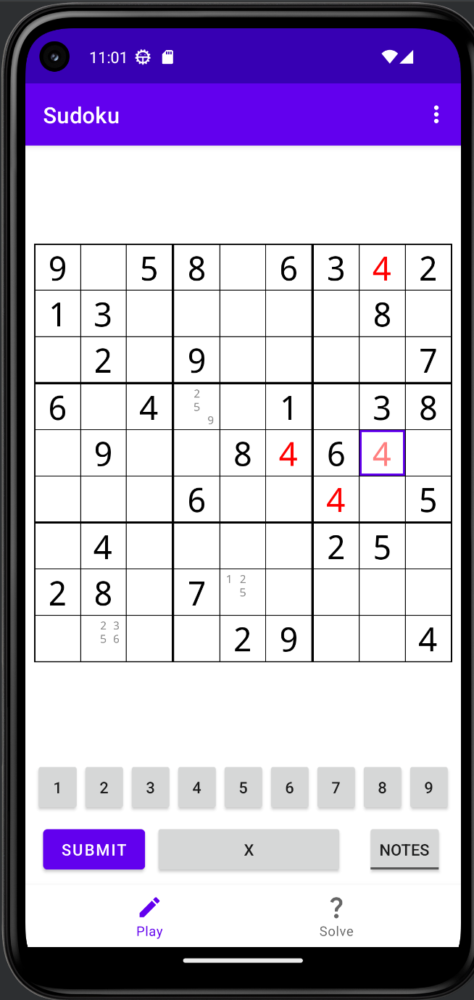

Finishing a sudoku:

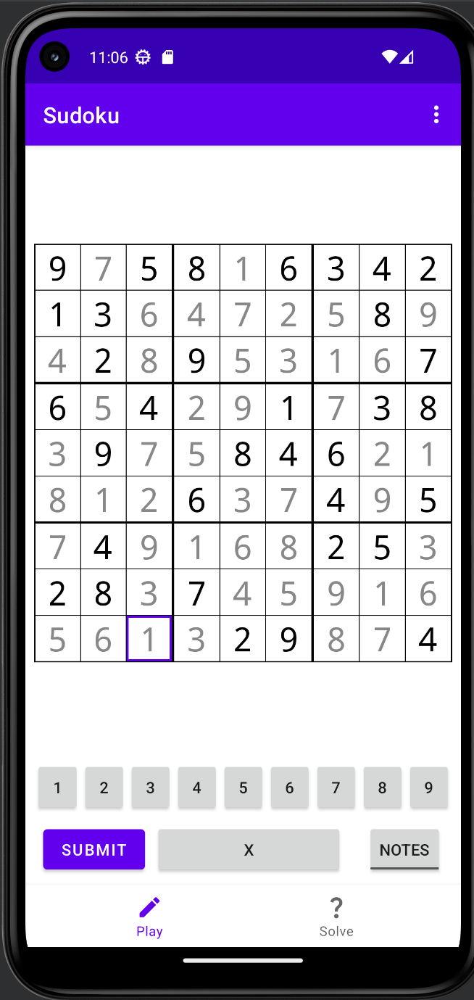

Submitting the finished sudoku:

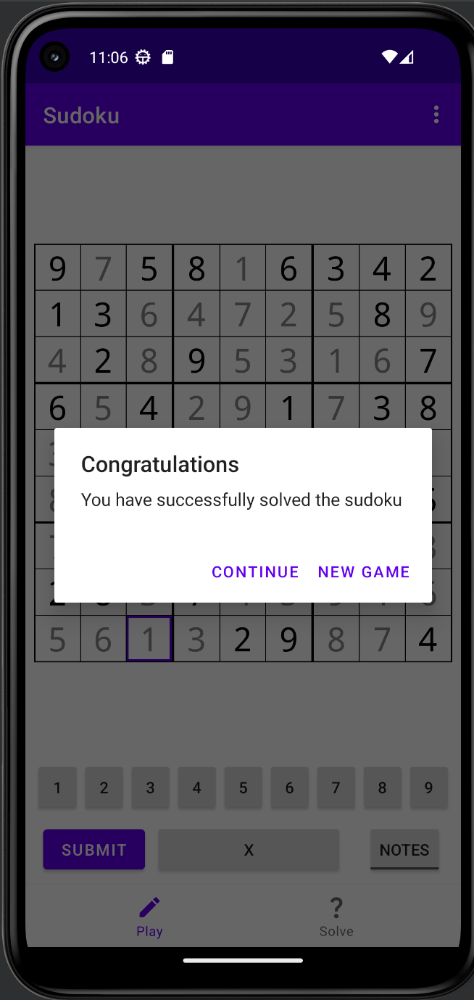

Pressing "new game" results in the same menu being shown as in the first screenshot. The user can also request a
new sudoku at any time before finishing by using the kebab menu:

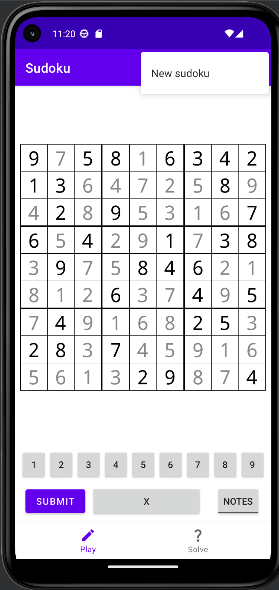

## Solver

The sudoku solver provides a similar menu for creating a grid, but without the difficulty option:

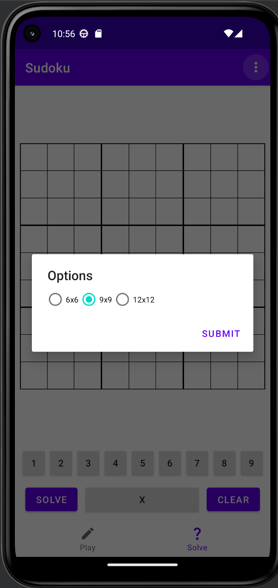

The following is an example of entering a sudoku into the solver:

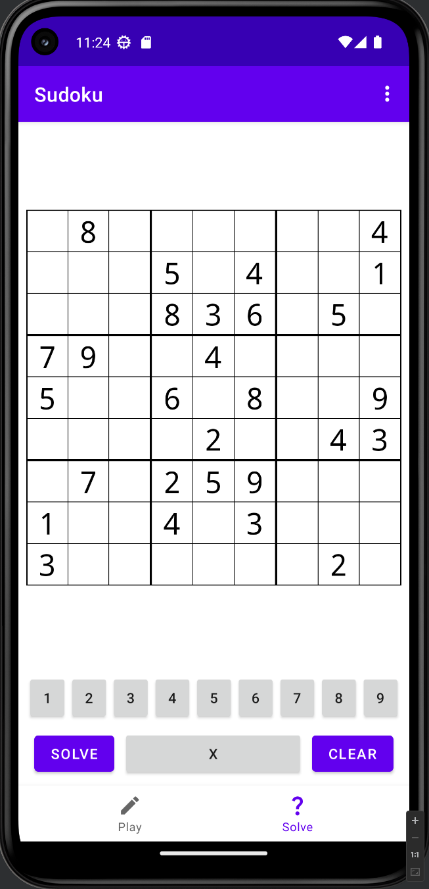

Pressing "solve":

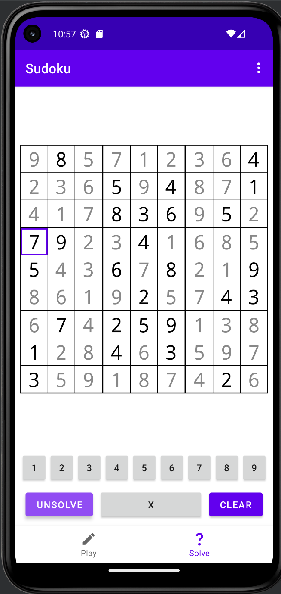

Care is also taken to ensure that when there are no solutions, this is quickly
detected, and reported to the user:

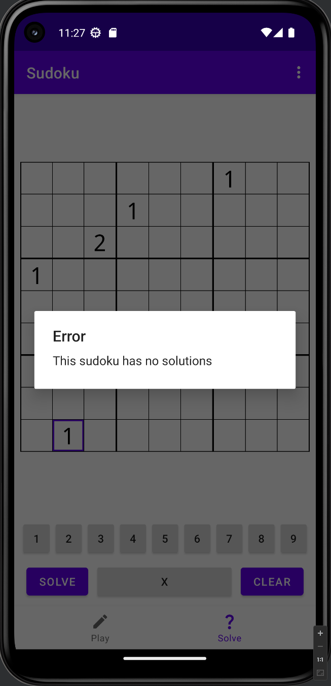
